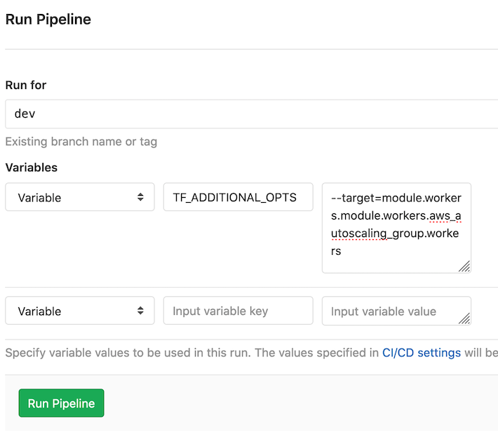

## Updating to v2.0.0

This major version changes the solution from having used a self-managed node group, to now using a **managed** node group. This is **NOT AN IN-PLACE UPDATE**, to use this version please create a new node group Terraform composition and then delete your old node group composition, instead of attempting to update your current nodes. Managed node group adds a number of additional benefits, just to highlight a few:

- Easily use _SPOT_ instances.
- Managed node draining from cluster when scalling in or replacing nodes.
- Automatic rollout of nodes upon updating.

### Steps

To replace your existing self-managed node group with the  managed node group, it is best to do a blue/green deployment.

#### Step 1 - Create New Managed Node Group

Basically create a new Terraform composition that contains the managed node group code. You can follow the steps within the [Example Usage](README.md#example-usage) to use the examples provided in this module.

Your composition folders will go from something like this:

```
.
├── eks-cluster
├── eks-workernodes
└── terraform-backend
```

To this:

```
.
├── eks-cluster
├── eks-managed-nodegroup-1
├── eks-workernodes
└── terraform-backend
```

#### Step 2 - (Optional) Drain Old Nodes

This step is optional if you don't mind causing a service disruption i.e. in Dev environments. Otherwise, i.e. for Prod environments, you may want to gracefully shift your workloads to the new instances instead of causing service disruption.

1) `kubectl get nodes` - Obtain list of nodes.
2) Identify which nodes are which EC2 instances (hostname's reflect the EC2 private IP address).
3) `kubectl cordon <node name>` - Ensure no additional workloads are schedule to the node.
4) `kubectl drain <node name> --ignore-daemonsets` - Remove all current workloads from the node, Kubernetes will reschedule them elsewhere.

#### Step 3 - Delete Old Worker Nodes

- This stack does not have any pre-requisites in order to successfully remove it.
- To delete this module's deployment follow the steps located within the [Destroying Deployment](https://gitlab.devops.telekom.de/ccoe/teams/evangelists/examples/ccoe-tf-aws-examples#destroying-deployment) section of the [ccoe-tf-aws-examples](https://gitlab.devops.telekom.de/ccoe/teams/evangelists/examples/ccoe-tf-aws-example) page.

## Updating to v0.2.0

Due to a combination of resource dependencies and Terraform execution limitations. Updating the worker nodes to v0.2.0 requires key steps. These steps focus on the **eks-workernodes** compisition, no changes are required within other compositions.

### Pre-requisite

Prior to reaching the below steps you need to have the latest code within your environment branch. If you follow a `Feature Branch > Merge Request > Merge to Environment Branch` strategy then ensure you do not deploy the changes once merged.

### Step 1 - Target Specification Pipeline

We need to execute the environment pipeline with the `--target` specification, the goal is to create the new launch templates and update the existing ASGs to use them instead of the old launch configurations.

1. Run a pipeline for the target environment (dev | prod).
2. Specify an environment variable with the following configuration **Key:** `TF_ADDITIONAL_OPTS` and **value:** `--target=module.workers.module.workers.aws_autoscaling_group.workers`
3. Execute this pipeline for the `eks-workernodes` composition **only**.



### Step 2 - Rerun environment pipeline

The previous step resolved the dependency issues between resources which was introduced by migrating from launch configurations to launch templates. Now we just need to re-run the environment pipeline with the default settings to delete the old launch configurations.

1. Run a pipeline for the target environment (dev | prod).
2. Deploy the changes (which will only delete the old launch configurations)

### Step 3 - Recreate Instances

The update is completed, as with any modifications that change the instance configuration the ASG will not automatically update already deployed EC2 instances. Now you will need to terminate existing instances so that the ASG will recreate them with the new configuration (or follow another strategy depending on your experience i.e. manual rolling update).