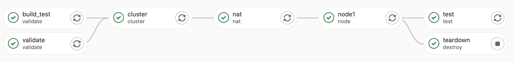
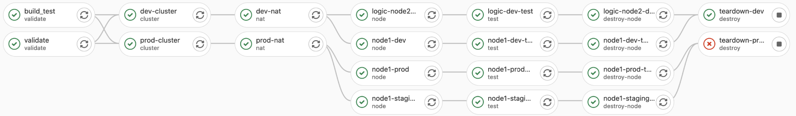

# GitLab Testing Pipeline <!-- omit in toc -->

- [Pipelines](#pipelines)
- [Scripts](#scripts)
- [Long-Lived Environments](#long-lived-environments)
- [Pipeline Setup](#pipeline-setup)
  - [Job Description](#job-description)
  - [Execution Matrix](#execution-matrix)
- [Tests](#tests)
  - [Overview - Terraform Tests](#overview---terraform-tests)
  - [Integration Tests](#integration-tests)

This document outlines the Pipelines and testing performed for code in this repository.

## Pipelines

There are **three** pipeline types that are executed.

| Name      | Trigger                                                       | Description                                                                                                                                                              |
| --------- | ------------------------------------------------------------- | ------------------------------------------------------------------------------------------------------------------------------------------------------------------------ |
| Feature   | Commits to `feature/*` branches                               | Creates a long-lived development environment that allows to actively review the changes made.                                                                            |
| MR to Dev | Once an MR to Dev is created.                                 | Any subsequent commits trigger an MR pipeline, and the feature branch pipeline is no longe executed.                                                                     |
| Example   | Merge Requests to `master` and Tagging with `vX.X.X` pattern. | Will run automated pipeline for `example/` code. Does so by removing Terraform backend configuration and removing example specific variables (`cluster_name` and `name`) |

## Scripts

The following scripts ar eused by the pipeline.

| Name               | Description                                                                                                                                                                                                                                                                                                     | Script                          |
| ------------------ | --------------------------------------------------------------------------------------------------------------------------------------------------------------------------------------------------------------------------------------------------------------------------------------------------------------- | ------------------------------- |
| Version Validation | The first check performed by all jobs is whether the version has been bumped within the CHANGELOG.md and the example code, if not then deployments fail. This script also replaces the version refspec within the Terraform example code for merge requests, in order to succesfully test the example code.     | `validate_version.sh`           |
| EKS Cluster        | In order for the worker nodes to be properly tested, they need to join an EKS cluster. Therefore for each test job we deploy a dedicated EKS cluster. In order to do so we clone the latest code from the ccoe-tf-aws-infra-eks-cluster repository, Terratest then uses this code to deploy the infrastructure. | `eks_clone_and_validate.sh`     |
| EC2 NAT            | All worker nodes tests are executed with configuration to the `var.use_nat_gw = true`. This requires NAT instances to be deployed. In order to do so we clone the latest code from ccoe-tf-aws-infra-ec2-nat repository, Terratest then uses this code to deploy the infrastructure.                            | `ec2_nat_clone_and_validate.sh` |

## Long-Lived Environments

The Golang code will conditionally configure the backend if certain variables are passed to it:

| Variable                        | Description                                                                                                |
| ------------------------------- | ---------------------------------------------------------------------------------------------------------- |
| EKS_CLUSTER_BACKEND_CONFIG_PATH | Path to backend.config file.                                                                               |
| EC2_NAT_BACKEND_CONFIG_PATH     | Path to backend.config file.                                                                               |
| WORKERNODES_BACKEND_CONFIG_PATH | Path to backend.config file.                                                                               |
| WORKSPACENAME                   | Workspace name that will be created if using an S3 backend. It will also be used to name all the resources |

## Pipeline Setup

The pipelines have the following stages:

- **validate** - Performs prerequisites checks and builds for pipeline execution.
- **cluster** - Deploys an EKS cluster.
- **nat** - Deploys NAT instances.
- **node** - Deploys the Node Group.
- **test** - Executes the tests against the deployment.
- **destroy-node** - Destroys the nodes.
- **destroy** - Destroys NAT and EKS (feature branch will destroy node here instead).

### Job Description

| Name          | State        | Description                                                                                                                                                                                                                  |
| ------------- | ------------ | ---------------------------------------------------------------------------------------------------------------------------------------------------------------------------------------------------------------------------- |
| validate      | validate     | Ensure version has been bumped, fail job if not. Initialize all Terraform code (root) and validate it. Create artifacts for feature `teardown` job to work correctly.                                                        |
| build_test    | validate     | Executes `go test -c` to create a binary of the Golang Terratest code. This serves not only to validate the Terratest code but also saves considerable amount of time instead of having each job needing to build it itself. |
| cluster       | cluster      | Executes the `eks_clone_and_validate.sh` script and runs the test code with only the EKS Cluster deployment stage.                                                                                                           |
| nat           | nat          | Executes the `ec2_nat_clone_and_validate.sh` script and runs the test code with only the EC2 NAT deployment stage.                                                                                                           |
| node          | node         | Runs the test code with only the node deployment stage.                                                                                                                                                                      |
| test          | test         | Runs the test code with only the actual testing stages, it will not deploy or destroy infrastructure.                                                                                                                        |
| node-teardown | destroy-node | Runs the test code with only the node cleanup stage. Will not destroy NAT or EKS cluster                                                                                                                                     |
| env-destroy   | destroy      | Runs the test code with both the  EC2 NAT and EKS cluster cleanup stages. In feature branch this will also destroy the node.                                                                                                 |

### Execution Matrix

#### Feature Pipeline

#### MR to Dev

>Notice the reused VPC specific components such as the EKS cluster and EC2 NAT for multiple nodes.

## Tests

The following custom tests are performed:

### Overview - Terraform Tests

| Name                      | Description                                                                                                                                         | Reason                                                                                             |
| ------------------------- | --------------------------------------------------------------------------------------------------------------------------------------------------- | -------------------------------------------------------------------------------------------------- |
| Nat Stack Config          | Check Instance and Role names follow expected standard                                                                                              | Ensures no naming overlap in multi-stack creation scenario                                         |
| Check NAT IP Maps         | Checks the IP addresses of NAT instances align with the subnets of deployed workernodes                                                             | Ensures that the data calls and userdata configuration for routing is set correctly on workernodes |
| Check Subnets             | Checks the subnets that the worker nodes were deployed to.                                                                                          | Confirms that the subnet auto-discovery works as expected                                          |
| Change Subnet Definitions | Removes the usage of removing subnet auto-discovery (i.e. sets `subnets_include_private` to `false`) and manually define the `subnet_ids` variable. | Confirm that the Terraform code has no adverse effects                                             |

### Integration Tests

| Name                     | Description                                                                                                                          | Reason                                                                                                                                                  |
| ------------------------ | ------------------------------------------------------------------------------------------------------------------------------------ | ------------------------------------------------------------------------------------------------------------------------------------------------------- |
| Check Kubernetes Cluster | Ensure CoreDNS pods and AWS Load Balancer controller are running succesfully, as well as testing a new deployment using Nginx image. | Ensures no issues with required components such as; Running Docker on nodes, pulling images (proxy config), running ingress controller, and cluster DNS |
